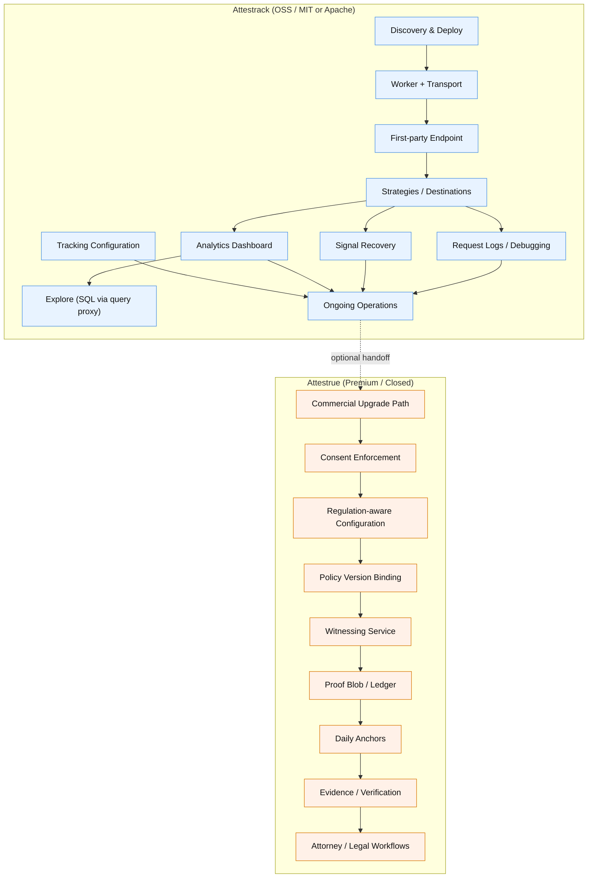

# Attestrack — User Journey Specification

**Version 2.0 — March 2026**  
**Status: Authoritative reference (open-source Attestrack only)**  
**Scope: Discovery through working Attestrack deployment · Analytics, transport, debugging, and destination delivery**  
**Audience: Product · Engineering · Design**

---

## Version Notes

**v2.0 changes**

- Journey is **split by repository boundary** (not license text)
- This document defines **only the open-source Attestrack experience**
- Consent enforcement, regulation, policy binding, witnessing, and proof/evidence are **moved entirely to Attestrue**
- No BSL or mixed-license language — **separation is by repo, not license**
- Open journey is strictly:
  - measurement
  - transport
  - analytics
  - debugging
  - destination delivery

**v1.3 and earlier**

- Superseded by v2.0 for the open journey
- Prior stages (6–9) now exist only in the Attestrue premium spec

---

## Preamble

This document defines the user journey for **Attestrack** — from discovery through a working **analytics and server-side measurement deployment** and use of the **community portal**.

**Attestrack does not include:**

- Consent enforcement
- Regulation-aware configuration
- Policy versioning or binding
- Evidence or legal workflows
- Independent witnessing

These are **Attestrue capabilities** and are not part of the open-source system.

The Attestrack portal may present a **handoff to Attestrue**, but those capabilities are not part of the Attestrack product contract or UX surface.

This document is declarative. It defines **user experience and outcomes**, not implementation.

---

## Product Boundary Principle

**Open-source Attestrack provides:**

- Measurement
- Transport
- Analytics
- Debugging
- Destination delivery

**Attestrue (closed product) provides:**

- Consent logic
- Regulatory profiles
- Policy binding
- Witnessing
- Proof/evidence
- Legal workflows



---

## User Types

### User A — Developer
- Arrives via GitHub / HN / technical communities
- Comfortable with terminal and infrastructure
- Reads code before deploying

### User B — Operator
- Arrives via marketing or referral
- Wants system running and observable
- Uses portal for monitoring and operations

### User C — Data Analyst
- Arrives after deployment
- Uses SQL and analytics surfaces
- Focused on attribution, funnels, and performance

All users share the **community portal**.

---

## Journey Overview

```

Stage 1:   Discovery and evaluation
Stage 2:   Pre-deployment decision
Stage 3:   Deployment
Stage 4:   Validation mode
Stage 5:   Portal orientation
Stage 5a:  Analytics orientation
Stage 6:   Tracking configuration
Stage 7:   Ongoing operation
Stage 7a:  Analytics and data exploration

````

---

## Attestrue Handoff (Outside Attestrack)

Consent enforcement, regulation-aware configuration, policy binding, evidence, and witnessing are part of **Attestrue**.

Attestrack may link to Attestrue for activation, but these capabilities are:

- not implemented in Attestrack
- not part of this journey
- defined entirely in the Attestrue repository

---

## Stage 1: Discovery and Evaluation

### Entry Points

- GitHub
- Developer communities (HN, forums)
- attestrack.com
- attestrue.com (referral)
- Word of mouth

### User Questions

1. Does this replace existing tools?
2. Is it technically credible?
3. What is the effort to deploy?

### Exit Criteria

User decides to deploy.

---

## Stage 2: Pre-Deployment Decision

### Decisions

- Tracking subdomain (`t.yourdomain.com`)
- Strategies (ad platforms)
- Analytics destination (ClickHouse / Tinybird / none)

### Exit Criteria

User has credentials and configuration ready.

---

## Stage 3: Deployment

### Command

```bash
npx @attestrack/deploy
````

*(If using legacy package name: `@attestrack/deploy`, this deploys Attestrack.)*

---

### Deployment Steps

1. Cloudflare authentication
2. Site identifier (`SITE_ID`)
3. Subdomain
4. Strategy selection
5. Analytics destination (optional)
6. Resource creation (Worker, KV, D1, R2)
7. Worker deploy
8. Portal deploy

---

### Completion Output

* Worker URL
* Portal URL
* DNS CNAME instructions
* Script tag instructions

The script is the **Attestrack loader**
(currently shipped as `consent.js`)

---

### Validation Message

Deployment starts in **validation mode**:

* events should flow
* destinations should receive data
* analytics should populate

---

### Exit Criteria

* Deployment running
* Portal accessible
* User ready to validate

---

## Stage 4: Validation Mode

### Purpose

Confirm:

* events are recorded
* destinations function correctly
* measurement pipeline is valid

### Not Included

* consent enforcement
* gating logic
* legal workflows

---

### Exit Criteria

* Events confirmed
* Destinations healthy
* Errors understood or resolved

---

## Stage 5: Portal Orientation

### Information Architecture

* Signal Recovery
* Destinations
* Request Logs
* Cookies
* Analytics Dashboard
* Explore
* Strategies
* Site Config

---

### Not Included

* Consent Events
* Evidence Chain
* Banner Config
* Policy Versions

---

### Exit Criteria

User understands portal structure.

---

## Stage 5a: Analytics Orientation

### Surfaces

**Analytics Dashboard**

* curated views
* volume, recovery, funnels
* destination health

**Explore**

* SQL editor
* warehouse-backed queries
* chart visualization

---

### Important Boundary

Additional event dimensions may be explored analytically.

Interpretation as:

* legal evidence
* enforcement state

is **out of scope**.

---

### Exit Criteria

* User runs a query
* Understands data stays in their warehouse

---

## Stage 6: Tracking Configuration

### Includes

* Strategy enable/disable
* Credentials
* Trusted domains
* Operational tracking settings

### Excludes

* Consent UI
* Policy management
* Jurisdiction configuration
* Enforcement activation

---

### Exit Criteria

Tracking matches business needs.

---

## Stage 7: Ongoing Operation

### Activities

* Monitor dashboards
* Check destination health
* Review logs
* Handle strategy issues
* Investigate drift or integrity alerts

---

### Drift Scope

Applies only to:

* scripts
* destinations
* measurement integrity

---

### Excludes

* Policy updates
* Evidence workflows
* Consent enforcement metrics

---

### Exit Criteria

Continuous operation

---

## Stage 7a: Analytics and Data Exploration

### Ongoing Usage

* campaign analysis
* attribution queries
* funnel exploration
* signal recovery analysis
* bot detection

---

### Tools

* Analytics Dashboard
* Explore (SQL)
* Saved queries (KV-backed)

---

### Guarantees

* Data remains in customer infrastructure
* No external analytics dependency required

---

## Journey Summary

| Stage | Actor | Outcome              |
| ----- | ----- | -------------------- |
| 1     | A / B | Decision to deploy   |
| 2     | A / B | Config ready         |
| 3     | CLI   | Deployment live      |
| 4     | A / B | Validation complete  |
| 5     | A / B | Portal understood    |
| 5a    | C     | First query run      |
| 6     | A / B | Tracking configured  |
| 7     | A / B | Ongoing operation    |
| 7a    | C     | Continuous analytics |

---

## Appendix A — Analytics Implementation Strategy

### Architecture

Query proxy pattern:

* portal → worker → customer warehouse → results

No embedded BI dependency.

---

### Stack

* Charts: Recharts
* Advanced charts: ECharts
* SQL editor: CodeMirror
* Tables: TanStack Table

---

### Query Constraints

* SELECT only
* schema allowlist
* enforced limits
* timeout protection

---

### Saved Queries

* stored in customer KV
* no external transmission
* reusable and shareable

---

### Why Not Grafana

* requires separate deployment
* adds operational complexity

---

### Why Not Embedded Analytics SaaS

* breaks "data stays in your infra"
* introduces third-party processing

---

## Final Note

This specification defines the **complete open-source Attestrack journey**.

All consent, regulatory, evidence, and witnessing capabilities are:

* **out of scope**
* **not implemented here**
* **owned by Attestrue**

---

**Version 2.0 — March 2026**

```

---

